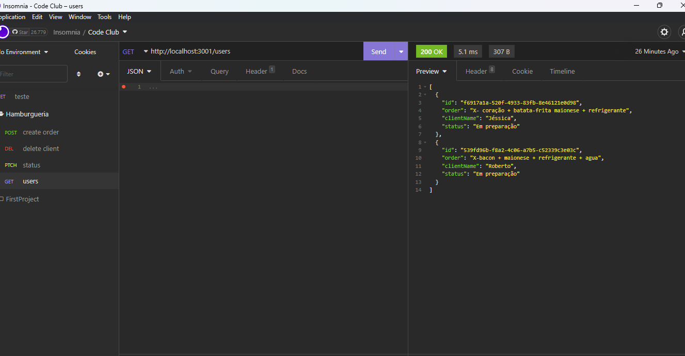

<h1 align="center"></h1>

<p align="center">
  

  

 

  

    

    

    
</p>


<p align="center">
  <a href="#dart-about">About</a> &#xa0; | &#xa0; 
  <a href="#sparkles-features">Features</a> &#xa0; | &#xa0;
  <a href="#rocket-technologies">Technologies</a> &#xa0; | &#xa0;
  <a href="#white_check_mark-requirements">Requirements</a> &#xa0; | &#xa0;
  <a href="#checkered_flag-starting">Starting</a> &#xa0; | &#xa0;
  <a href="#memo-license">License</a> &#xa0; | &#xa0;
  <a href="https://github.com/agostinhomarcia" target="_blank">Author</a>&#xa0; | &#xa0
  <a href="#" target="_blank" rel="noopener noreferrer">Projeto</a>
</p>

<br>

## :dart: About ##


<h4 align="center"> Burguer Code Club </h4>

<p align="center">
   
</p>
<p align="center">
   
</p>

<hr>
## :sparkles: Features ##

:heavy_check_mark: Feature 1;\
:heavy_check_mark: Feature 2;\
:heavy_check_mark: Feature 3;

## :rocket: Technologies ##

The following tools were used in this project:

- [Node](https://nodejs.org/en/)
- [Javascript](https://developer.mozilla.org/pt-BR/docs/Web/JavaScript) 


## :white_check_mark: Requirements ##

Before starting :checkered_flag:, you need to have [Git](https://git-scm.com) and [Node](https://nodejs.org/en/) installed.

## :checkered_flag: Starting ##


```bash
# Clone this project
$ git clone https://github.com/agostinhomarcia/hamburgueria-api.git
# Access
$ cd hamburgueria-api
# Install dependencies
$ yarn or npm 
# Run the project
$ yarn run dev or npm run dev
# The server will initialize in the <http://localhost:3000>
```
<hr>

## :memo: License ##


This project is under the [MIT license](./License).

Made with love by [Márcia Agostinho](https://github.com/agostinhomarcia) 🚀.


<hr>
&#xa0;

<a href="#top">Back to top </a>